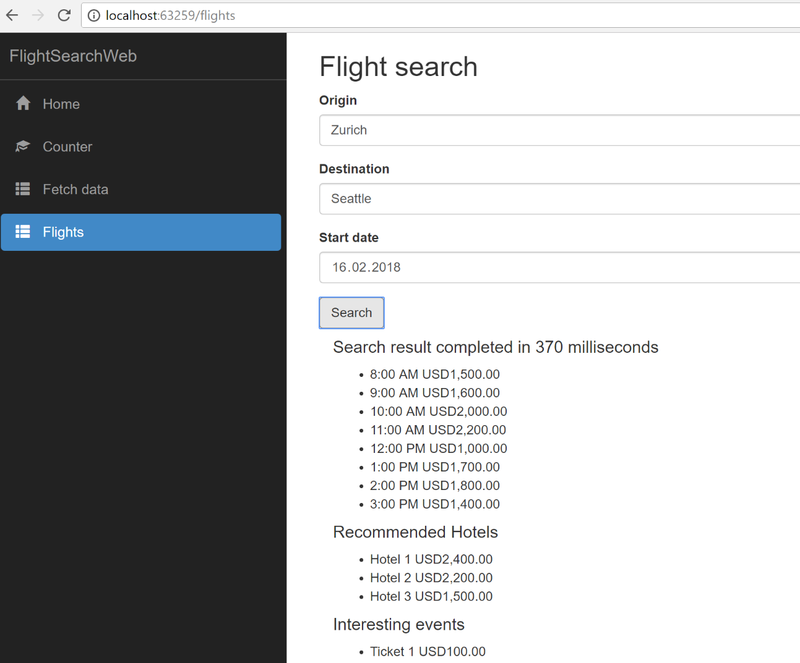
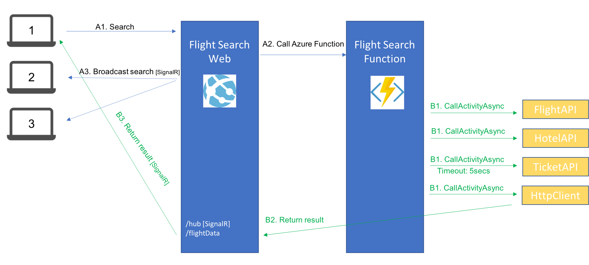
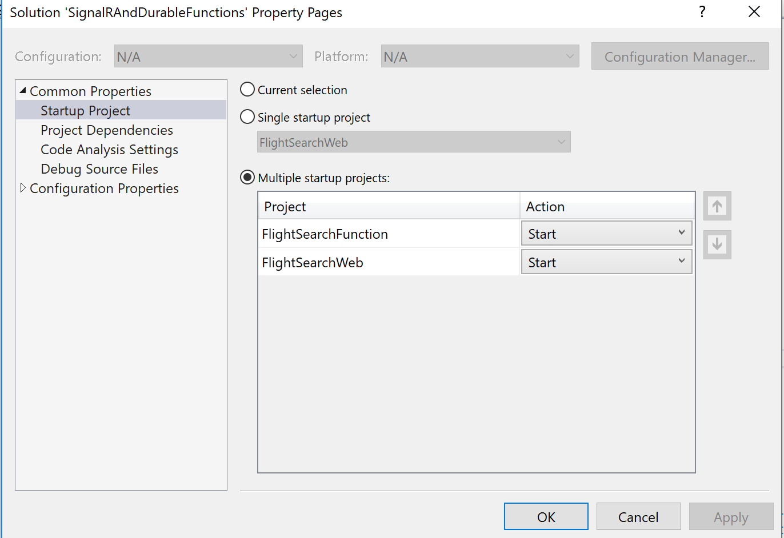

# Azure Durable Functions integration with SignalR

In this Flight search web application demonstrates the usage of Azure Durable Functions and SignalR.

## Azure Durable Functions
Durable Functions are a feature of Azure Functions currently in preview that allows you to orchestrate an series of activities inside a function. Those activities can be save a file, make a http request, query a database.
The Durable Function runtime will orchestrate the functions for you, putting your function to sleep while activities are executed in the background.

## SignalR 
[SignalR](https://github.com/aspnet/SignalR) is a library that allows a web server to client push communication for ASP.NET core applications (currently in preview).

## The Sample application

Users connect to FlightSearchWeb application, on {url}/flights opening a SignalR connection to receive broadcasts (what people are searching) and their own search results. A search result is submitted to FlightSearchWeb/flightData/search which makes the call to the Durable Azure Function.

The FlightSearchFunction simulates a complex search that uses 3 others APIs (also simulated): Flight, Hotel and Ticket. The search is using durable functions, executing in parallel. What it is special about it is that the we don't want to wait for more than 5 seconds for the ticket (event) search to finish. If it takes too long we just don't return any event in the search result.
At the end, the result is posted to the a returnUrl that was define in the search request, allowing the web application to send a direct message to the user that made the search (using SignalR), so that the user browser does not have to poll for statuses.

## Running / Debugging
In order to run the sample application make sure you have selected to debug both projects simultaneously in the solution properties.

